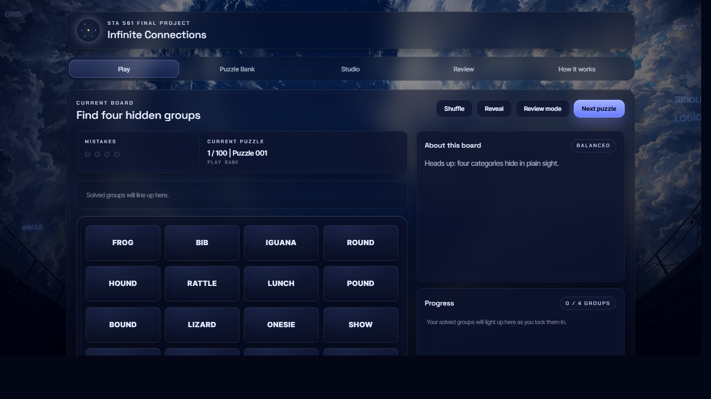
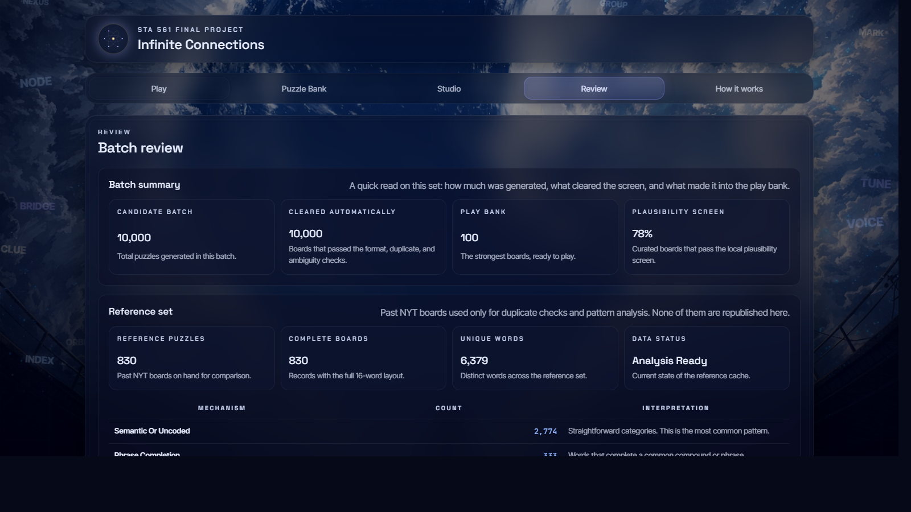

# Infinite Connections

Infinite Connections is a local generation, validation, and evaluation system for NYT Connections-style puzzle boards. The project was developed as a single-author final project for STA 561: Probabilistic Machine Learning at Duke.

This repository contains the full project artifact used for submission: the generator, screening and audit code, reference data, the playable website, and the cached outputs used in the report.

## Live demo

- Website: [sta561-infinite-connections-site.vercel.app](https://sta561-infinite-connections-site.vercel.app)

## Project scope

The system is organized around four stages:

1. Generate candidate boards from multiple mechanism families, including semantic categories, phrase-completion structures, and wordplay patterns.
2. Screen those boards for schema validity, historical overlap with past NYT boards, and structural ambiguity.
3. Score and audit the surviving boards with local evaluation scripts.
4. Publish the strongest boards into a curated bank that is exposed through the website.

The emphasis of the project is not only on generation, but on the decision layer between raw generation and publication.

## Repository contents

- `infinite_connections/` - generator, validator, solver, feature extraction, and supporting logic
- `scripts/` - setup, generation, curation, audit, and evaluation scripts
- `data/` - cached history sets, lexicons, puzzle outputs, and evaluation summaries
- `web/` - deployed interface for playing and reviewing the curated puzzle bank
- `tests/` - lightweight pipeline checks

## Interface snapshots

### Landing screen


### Play surface



### Review surface



## Reproducing the project locally

### 1. Install dependencies

```powershell
.\RUN_SETUP.bat
```

### 2. Launch the website

```powershell
python scripts\serve.py
```

The script prints the local URL in the terminal.

### 3. Generate and audit a batch

```powershell
python scripts\generate_batch.py --count 10000 --seed 5610417 --provider local --data-dir data --reference data/history/reference_sets.json
python scripts\audit_puzzle_batch.py --input data/puzzles/published.json --history data/history/unified_reference.json --out data/reports/raw_10k_audit.json
```

### 4. Rebuild the curated bank

```powershell
python scripts\build_curated_bank.py --puzzles data/puzzles/published.json --output data/puzzles/curated_100.json --target 100 --max-word-uses 5 --max-group-uses 1 --max-category-uses 4 --require-solver-unique
```

## Evaluation highlights

The report and cached evaluation files in `data/eval/` and `data/reports/` summarize the current project state. The central reproduced results are:

- 10,000-board batch generation
- 0 exact historical board overlaps
- 99.98% blind unique-match rate on the raw batch
- 100-board curated bank with 400 unique exact answer groups
- 100% blind unique-match rate on the curated bank

## Notes

This repository keeps the project in a reproducible local form. Cached outputs are included so the report, website, and code review all point to the same artifacts.
